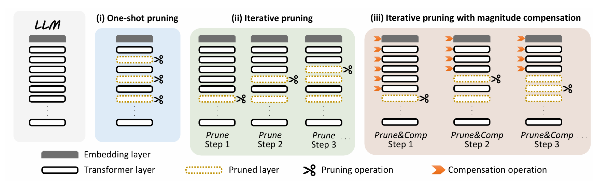

# Prune&Comp: Free Lunch for Layer-Pruned LLMs via Iterative Pruning with Magnitude Compensation

[AAAI 2026] Official PyTorch implementation of “Prune&Comp: Free Lunch for Layer-Pruned LLMs via Iterative Pruning with Magnitude Compensation”

[](https://arxiv.org/abs/2507.18212)

This repository contains the PyTorch implementation of the AAAI 2026 paper [Prune&Comp: Free Lunch for Layer-Pruned LLMs via Iterative Pruning with Magnitude Compensation](https://arxiv.org/abs/2507.18212).

<p align="center">
  
</p>

---

## 🧠 TL;DR

**Prune&Comp** is a *training-free*, *plug-and-play* framework for **iterative layer pruning** of Large Language Models (LLMs).  
It compensates for the **magnitude gap** caused by layer removal, resulting in **robust pruning stability** and **significant performance gains**—without retraining or inference overhead.

- **Training-free & lightweight**  
- **Stabilizes iterative pruning** through *magnitude compensation*  
- **Boosts performance across PPL, MMLU, and QA tasks**  
- **Compatible with any pruning metric** (e.g., CosSim, Taylor+, PPL, Mag+)  

---

## 📋 Contents

- [Preparations](#preparations)
- [Usage](#usage)
- [Results](#results)
- [References](#references)

---

## ⚙️ Preparations

### Installation

```bash
conda create -n prunecomp python=3.10 -y
conda activate prunecomp
pip install -r requirements.txt
````

### Model Preparation

Download the official model weights from HuggingFace:

| Model                        | Download Link                                                                                                                      |
| ---------------------------- | ---------------------------------------------------------------------------------------------------------------------------------- |
| LLaMA-2-7B                   | [https://huggingface.co/meta-llama/Llama-2-7B](https://huggingface.co/meta-llama/Llama-2-7B)                                       |
| LLaMA-3-8B                   | [https://huggingface.co/meta-llama/Llama-3.1-8B](https://huggingface.co/meta-llama/Llama-3.1-8B)                                   |
| Qwen3-8B                     | [https://huggingface.co/Qwen/Qwen2-8B](https://huggingface.co/Qwen/Qwen2-8B)                                                       |
| DeepSeek-R1-Distill-Llama-8B | [https://huggingface.co/deepseek-ai/DeepSeek-R1-Distill-Llama-8B](https://huggingface.co/deepseek-ai/DeepSeek-R1-Distill-Llama-8B) |

### Data Preparation

Calibration & evaluation datasets can be downloaded from HuggingFace:

| Dataset   | URL                                                                                                                        |
| --------- | -------------------------------------------------------------------------------------------------------------------------- |
| WikiText2 | [https://huggingface.co/datasets/Salesforce/wikitext](https://huggingface.co/datasets/Salesforce/wikitext)                 |
| C4        | [https://huggingface.co/datasets/allenai/c4](https://huggingface.co/datasets/allenai/c4)                                   |
| PTB       | [https://huggingface.co/datasets/ptb-text-only/ptb_text_only](https://huggingface.co/datasets/ptb-text-only/ptb_text_only) |

QA benchmarks are loaded using `lm_eval` (v0.4.4):

| Dataset          | URL                                                                                                      |
| ---------------- | -------------------------------------------------------------------------------------------------------- |
| ARC-e / ARC-c    | [https://huggingface.co/datasets/allenai/ai2_arc](https://huggingface.co/datasets/allenai/ai2_arc)       |
| HellaSwag        | [https://huggingface.co/datasets/Rowan/hellaswag](https://huggingface.co/datasets/Rowan/hellaswag)       |
| PIQA             | [https://huggingface.co/datasets/ybisk/piqa](https://huggingface.co/datasets/ybisk/piqa)                 |
| BoolQ, CoPA, WSC | [https://huggingface.co/datasets/aps/super_glue](https://huggingface.co/datasets/aps/super_glue)         |
| WinoGrande       | [https://huggingface.co/datasets/allenai/winogrande](https://huggingface.co/datasets/allenai/winogrande) |
| Race-h           | [https://huggingface.co/datasets/ehovy/race](https://huggingface.co/datasets/ehovy/race)                 |

---

## 🚀 Usage

We provide example scripts for running **Prune&Comp**.
A typical example for **CosSim(BI)** metric on **LLaMA-3-8B**:

```bash
bash run.sh
```

Inside `run.sh`:

```bash
# CosSim(BI)
CUDA_VISIBLE_DEVICES=0 python CosSim_BI.py \
--model /path_to_models/llama-3-8b \
--num_to_prune 5 \
--log_dir /path/results/llama-3-8b/BI-p5 \
--eval_ppl \
--eval_mmlu \
--eval_tasks "wsc273,hellaswag,piqa,arc_easy,arc_challenge,boolq,winogrande,race,copa" \
--save_dir /path/save/llama-3-8b/BI-p5  # save_dir is optional
```

You can replace `CosSim_BI.py` with your preferred metric implementation (e.g., `CosSim(CL)`, `Taylor.py`, `PPL.py`, `Mag+.py`).

---

## 📊 Results

### Perplexity (PPL) Comparison

| Model             | Metric         | Baseline | + Prune&Comp | Δ      |
| ----------------- | -------------- | -------- | ------------ | ------ |
| LLaMA-3-8B (5/32) | **Taylor+**    | 512.78   | **16.34**    | ↓96.8% |
| LLaMA-3-8B (5/32) | **CosSim(BI)** | 28.73    | **14.56**    | ↓49.3% |
| LLaMA-2-7B (7/32) | **Mag+**       | 89.61    | **28.20**    | ↓68.5% |

---

### QA Benchmark (LLaMA-3-8B)

| Pruning Ratio | Method                      | Avg. Acc. | RP (%)     |
| ------------- | --------------------------- | --------- | ---------- |
| 5/32          | Taylor+                     | 65.85     | 100        |
| 5/32          | **Taylor+ + Prune&Comp**    | **90.57** | **+24.72** |
| 7/32          | CosSim(BI)                  | 61.54     | 100        |
| 7/32          | **CosSim(BI) + Prune&Comp** | **87.64** | **+26.10** |

---

### MMLU Benchmark (LLaMA-3-8B, 5 Layers Pruned)

| Metric     | Weighted Acc. | +Prune&Comp | Gain  |
| ---------- | ------------- | ----------- | ----- |
| Taylor+    | 38.64         | **48.42**   | +9.78 |
| CosSim(BI) | 57.64         | **58.98**   | +1.34 |

---

### Ablation Study

| Variant                                    | Avg. PPL ↓ |
| ------------------------------------------ | ---------- |
| Naive one-shot                             | 58.43      |
| +Iterative Pruning                         | 38.37      |
| +Magnitude Compensation                    | 37.39      |
| **+Iterative + Compensation (Prune&Comp)** | **27.16**  |

---

## 📚 Citation

If you find **Prune&Comp** useful, please cite our paper:

```bibtex
@article{chen2025prunecomp,
  title={Prune\&Comp: Free Lunch for Layer-Pruned LLMs via Iterative Pruning with Magnitude Compensation},
  author={Chen, Xinrui and Zhang, Hongxing and Zeng, Fanyi and Wei, Yongxian and Wang, Yizhi and Ling, Xitong and Li, Guanghao and Yuan, Chun},
  journal={arXiv preprint arXiv:2507.18212},
  year={2025}
}
```

